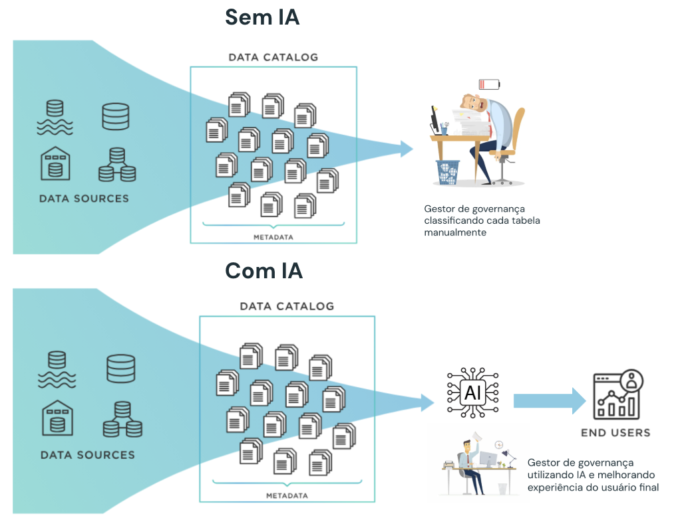

# Potencializando a Governança de Dados com GenAI

## Visão Geral

Este projeto demonstra a implementação de funções de governança de dados utilizando inteligência artificial no ambiente Databricks. O projeto inclui uma série de notebooks que automatizam processos de preparação, classificação e documentação de dados.

## Motivação 

Conforme os ambientes de dados vão crescendo, e a geração de dados passa a ser descentralizada, o controle de quais dados estão sendo salvos no banco torna-se cada vez mais desafiador. Os gerentes de governança tem o desafio de viabilizar as análises e consumo de dados ao mesmo tempo que controla a segurança do ambiente. Rapidamente passa a ser inviável realizar classificações manuais das tabelas. 

Com IA e criação de políticas, é possível gerenciar acesso e realizar classificação de dados em larga escala!

 ## Como navegar? 

 Inicie pelo notebook 00_abertura. 

 Com exceção do notebook 00_aux, recomendamos realizar a execução de célula a célula, buscando entender o que cada comando está realizando. O único caderno que exige inserção de comandos é o caderno 02_prompt.
 Mais instruções podem ser encontradas em cada caderno. 
